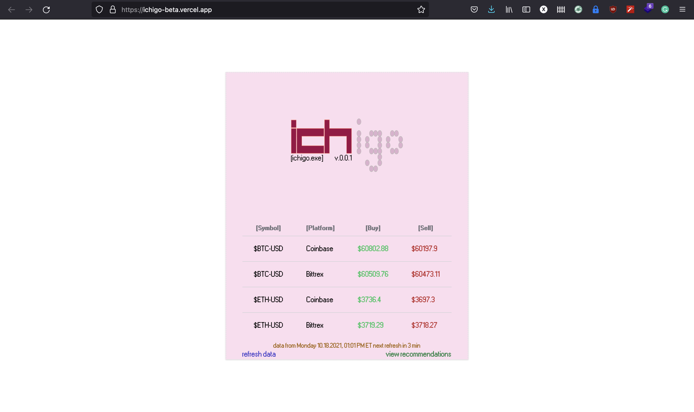
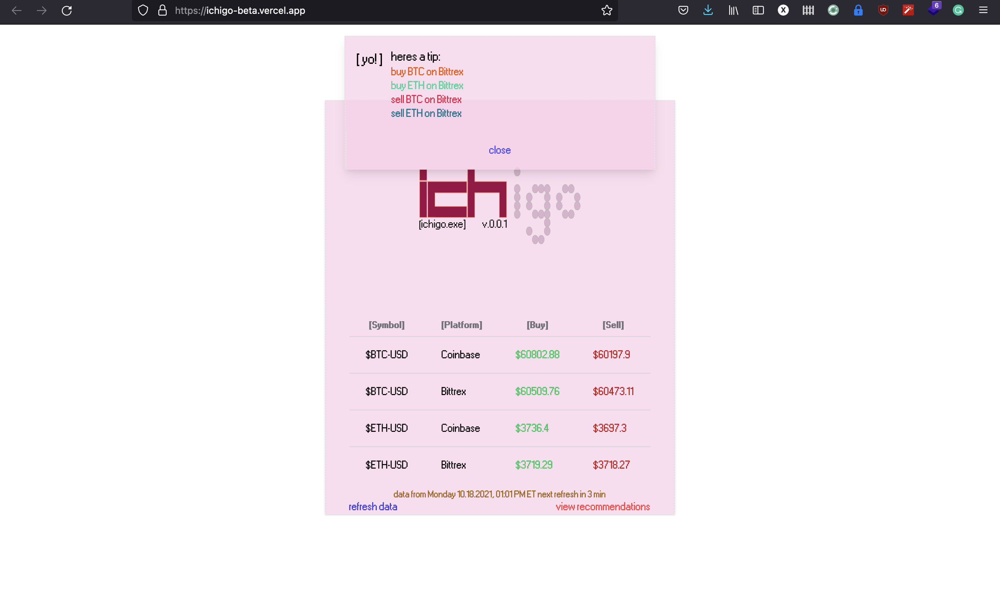
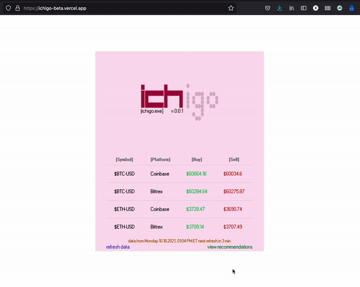

# ichigo 🍓 | chainalysis code assessment


### project goals: 
a webpage that does the following: 
- displays prices of bitcoin and ethereum in usd from any two crypto exchanges 
- recommends which exchange should be used for buying/selling each cryptocurrency 

### screenshots: 

 

 

 

### how to run: 
- clone git repo locally 
- have yarn + npm installed 
- cd into subdirectory called ichigo 
- run ```yarn install``` to install all dependencies then run ```yarn dev``` to start the dev server 
- the frontend is available on localhost:3000 by default but so is the backend which leads into: 

### architecture 
- ```frontend:``` nextjs/react, tailwindcss and swr for automated data fetching/re-rendering on a set timer 

- ```backend:``` relies entirely on nextjs serverless api routes which are basically just a modified version of express that gets bundled with all nextjs projects 

- ```data:``` data is pulled from the coinbase and bittrex public apis. both apis provided routes with the latest buy/sell prices for each symbol (btc-usd, eth-usd...)


### questionnaire: 
[questionnaire answer link](QUESTIONS.md)


